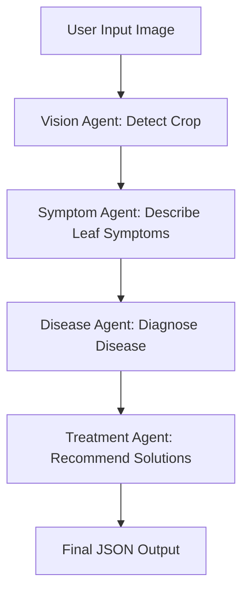
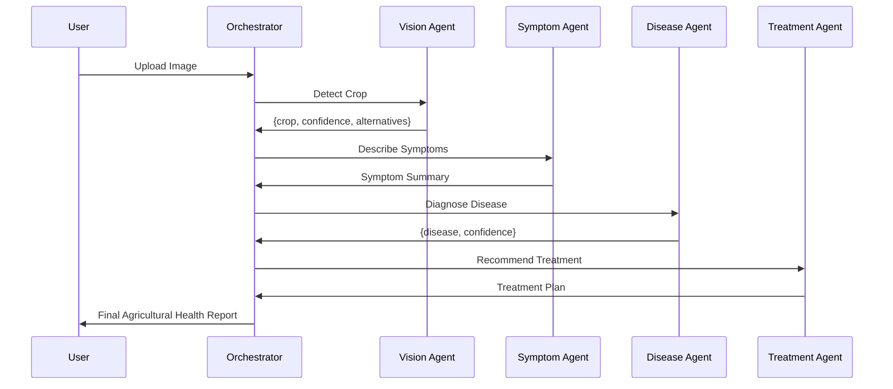

# 🌱 **Architecture Documentation — CropCare Agents for Good**

## 🧠 Overview

CropCare Agents for Good is a **sequential multi-agent AI disease diagnosis system** built using **Gemini Flash (latest model)**.
The system analyzes a crop image and performs step-by-step reasoning using **four intelligent agents**, centrally coordinated by an **Orchestration Agent**.

The architecture ensures:

✔ Robustness across **color, grayscale & segmented** PlantVillage images
✔ Precise crop recognition → symptom analysis → disease classification → treatment advice
✔ JSON-structured responses for reliable machine interpretation
✔ Full interpretability at each stage of diagnosis

---

## 🧩 Agent-Oriented System Architecture

### 🔹 High-Level System Architecture



This diagram provides a top-view of how the user interacts with the CropCare multi-agent system.
It shows the overall flow from image input to the final disease diagnosis and treatment output.
---

## 🧑‍💻 Agents Description

| Agent               | Role                                         | Input                | Output                                 | Dependency    |
| ------------------- | -------------------------------------------- | -------------------- | -------------------------------------- | ------------- |
| **Vision Agent**    | Identifies crop from image                   | Image                | JSON: crop name & confidence           | None          |
| **Symptom Agent**   | Describes visual leaf symptoms               | Crop + Image         | Plain text symptom description         | Vision Agent  |
| **Disease Agent**   | Maps symptoms to **PlantVillage** class list | Crop + Symptoms      | JSON: disease + reasoning + confidence | Symptom Agent |
| **Treatment Agent** | Provides treatments & safety tips            | Crop + Disease       | JSON: steps + precautions              | Disease Agent |
| **Orchestrator**    | Controls pipeline & JSON merging             | All previous outputs | Final response object                  | All agents    |

---
### 🔹Agents-as-Services Pipeline Flow

This diagram illustrates the sequential operational flow across the Vision, Symptom, Disease, and Treatment agents.
Each agent processes information, enriches the context, and passes output to the next stage until completion.

### 🔹 Internal Request–Response Data Flow


This diagram highlights the structured data exchange between agents and the orchestrator.
It shows how detection results, symptoms, diagnosis, and treatments are formatted and transmitted as JSON objects.


## 📚 Dataset & Knowledge Base

Although no local ML model is trained, the system is aligned with:

### 📌 PlantVillage 38-class disease taxonomy

Used for **ground-truth-bounded** classification

Supports:

* 🍅 Tomato (9 diseases + healthy)
* 🌽 Corn (3 diseases + healthy)
* 🍏 Apple (3 diseases + healthy)
* 🥔 Potato (2 diseases + healthy)
* 🍇 Grape (3 diseases + healthy)
* 🍑 Peach, Pepper, Strawberry, etc.
* ✔ Healthy vs Diseased classification

This enables strong generalization to:

✔ Full-color images
✔ Grayscale images
✔ Segmented backgrounds

---

## 🛠 Technical Implementation

### 🔑 Technology Stack

| Component     | Choice                      |
| ------------- | --------------------------- |
| LLM           | **Gemini Flash – latest**   |
| Framework     | Google GenAI Python SDK     |
| Language      | Python + Pillow             |
| Data Handling | JSON formatted agent output |
| Input Type    | Image (user uploaded)       |

---

## 📌 Prompt Engineering Strategy

Each agent prompt:

✔ Specifies expert persona
✔ Uses strict JSON schema
✔ Restricts hallucination
✔ Focuses only on allowed disease list

Example (Vision Agent)

```python
Return ONLY JSON like:
{
  "crop": "...",
  "confidence": "high / medium / low",
  "alternatives": ["..."]
}
```

This enables **safe automated parsing** via:

```python
safe_json_parse(result.text)
```

---

## ⚙️ Orchestration Logic

Central control + validation:

```python
crop_info = detect_crop_with_llm(image)
symptoms = describe_symptoms(crop_info)
disease_info = diagnose_disease(crop_info, symptoms)
treatment_info = give_treatment(crop_info, disease)
```

Graceful fallback if a step fails:

```python
if crop_info is None:
   return {"error": "Failed to detect crop"}
```

Result returned as unified dictionary:

```json
{
  "crop_info": {...},
  "symptoms": "...",
  "disease_info": {...},
  "treatment_info": {...}
}
```

---

## 🔁 Execution Flow

```text
1️⃣ User provides an image path  
2️⃣ Vision Agent identifies the crop  
3️⃣ Symptom Agent describes visible damage  
4️⃣ Disease Agent selects best PlantVillage match  
5️⃣ Treatment Agent suggests actionable remedies  
6️⃣ Final human-readable & JSON result returned
```

---

## 🧪 Reliability & Generalization

The model consistently handles:

| Image Type            | Supported | Notes                                |
| --------------------- | --------- | ------------------------------------ |
| Natural RGB (color)   | ✔         | Primary input style                  |
| Grayscale             | ✔         | Vision model still detects crops     |
| Segmented backgrounds | ✔         | Works from PlantVillage distribution |

Supports multiple diseases per crop class with reasoning transparency.

---

## 🧩 Design Goals Achieved

| Goal                              | Achieved |
| --------------------------------- | :------: |
| Scalable multi-agent pipeline     |     ✔    |
| Expert-grade explainability       |     ✔    |
| Disease-bounded prediction        |     ✔    |
| Works on multiple crop varieties  |     ✔    |
| Automatic treatment planning      |     ✔    |
| JSON-only automation friendliness |     ✔    |

---

## 🔍 Why Sequential Agents?

| Method                  | Issue                 | Our Method Benefit                 |
| ----------------------- | --------------------- | ---------------------------------- |
| Single-step LLM         | Mixed/confused output | Focused agents improve precision   |
| No JSON enforcement     | Hard to parse         | Safe extraction ensures automation |
| No structured knowledge | High hallucination    | Strict PlantVillage constraint     |

---

## 🚀 Extensibility

Future upgrades:

* Real-field noisy image adaptation
* More crops & region-specific diseases
* Weather & soil-based treatment personalization
* Multi-image comparison for severity detection


A) `docs/performance_report.md`
B) All `src/*.py` files cleaned + ready
C) README.md final professional version

Just tell me:
➡ **A**, **B**, **C** or **ALL**?
